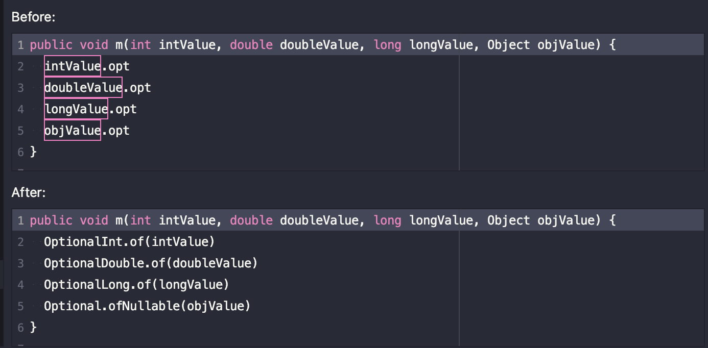
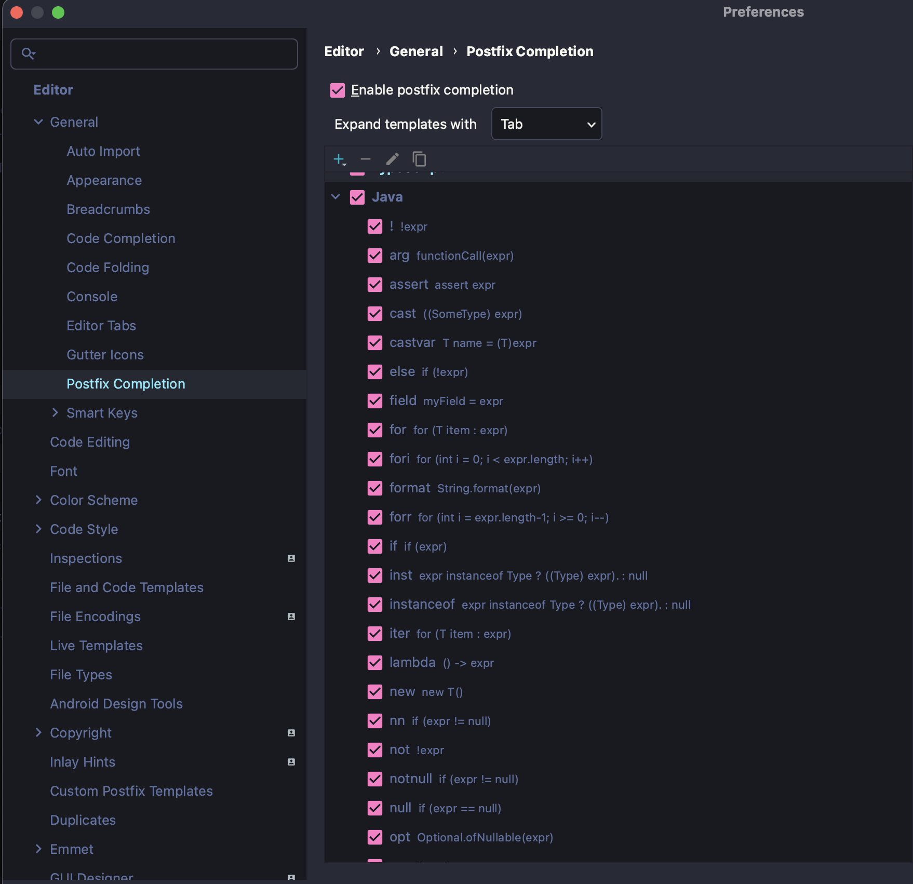

# Intellij tips

이 주제는 개발자로서 조금이라도 생산성을 높힐 수 있는 방법이 무엇이 있을까? 라는 생각에서 시작하게 되었습니다.

## Live Templates

개발자들은 반복적인 작업을 싫어합니다. 우리가 자주 사용하거나 작성하기 복잡한 내용을 템플릿화하여

좀 더 간편하고, 좀 더 빠르게 사용할 수 있다면 어떨까요? Intellij 에는  Live Templates이라는 편리한 기능이 있습니다

Live Templates이란 '약어'를 통해 사전에 정의된 code temaplate을 사용할 수 있는 기능입니다

### 다양한 Live Templates 소개

- psvm : public static void main

  - 

  - 

​				psvm을 타이핑 후 탭 혹은 엔터를 누르게 되면 약속된 템플릿이 자동으로 완성됩니다

- fori : iterlation loop 생성
- iter : iterable 또는 array iterate
  - 

- sout : System.out.println()
- soutm : 현재 클래스와 메서드 이름을 출력
- soutv : 선택한 변수를 출력
  - 

- ifn : if null
- inn : if not null
  - 

- 더 많은 templates : control + J 단축키를 누르게 되면 더 다양한 templates을 확인할 수 있습니다
  - 

-----------------

### Custom Live Template 만들기(1)

- Settings - Editor - Live Templates 

  

​	지금까지 확인할 수 있었던 template들이 group 별로 존재하는 것을 확인할 수 있습니다

​	C, JAVA, HTTP Request, MAVEN, SQL .. 다양한 group이 존재합니다

- 우측에 Add 버튼을 클릭!
  

​	JAVA  group에 새로운 template을 만들어 보도록 하겠습니다

​	template 추가는 오른쪽에 + 버튼을 눌러서 할 수 있습니다

- Custom Live Template 생성

  

  - Abbreviation :  template 약어
  - Description : template 설명
  - Template text
    - METHOD_NAME : 메서드 이름
    - ARGS : arguments
    - END : template을 추가했을 때 커서가 오는 위치
    - 변수는 $로 감싸주어야 함

- Edit Variables

  

​		default vaule에 기본 메서드 명을 설정해줄 수 있습니다

- 사용할 곳 정의 : Java - Declaration

  

JAVA group에 Declaration을 선택해주고 apply를 눌러주면 완료!

- custom live template 확인

  

위에서 설정한 prvm template 약어와 기본으로 설정된 메서드 이름을 확인할 수 있습니다

--------

### Custom Live Template 만들기(2)

더 나아가서 junit test에서도 활용해보도록 하겠습니다

- 가장 먼저 test용 코드를 작성하고, template으로 작성할 부분을 드래그 합니다
  

- 이후 Code - Save as Live Template 을 눌러줍니다
  
  - Abbrevation
  - Dscription
  - DISPLAY_NAME
  - METHOD_NAME
  - BODY
  - 사용할 곳 설정

- Edit Template Variables
  
  - DISPLAY_NAME : default value로 "Display name for my test" 작성
  - METHOD_NAME : Expression에 camelCase() 함수 사용, 파라미터로 DISPLAY_NAME을 전달
  - BODY : Assertion.fail 메서드 작성

​		

- 생성된 live template  확인
  

METHOD_NAME에 DISPLAY_NAME을 camel case로 전달해주었기 때문에, 

custom live template을 생성하고 DisplayName을 수정해주면 메서드 이름도 같이 변경됩니다

-----------

## Postfix Completion

Postfix Completion은 .(dot) 뒤에 오는 접미사을 통해 기존에 정의된 표현식으로 변환할 수 있는 기능입니다.

코드를 작성하다가 커서가 다시 앞으로 가지 않아도 되어서 편리(?)한 것이 장점이라고 합니다

- var : "PostFix"에 해당하는 변수를 생성
  - before
    
  - after
    

- for

  

- new
  

- nn
  

- opt
  

- try
  

- 더 많은 postfix 목록
  

--------------

## Navigation in Intellij

### Find Recent Files

- 최근에 열어보거나 수정한 파일들의 목록을 확인할 수 있습니다
- split right : 해당 파일을 shift + enter 로 열게 되면 오른쪽에 분할되어 창이 열립니다
- back space 또는 delete를 누르면 목록에서 파일이 삭제됩니다

- Recent Files 목록에서 검색
  

### Recent Locations

- 최근에 열어보거나 수정한 파일들의 디테일한 코드 및 위치를 확인할 수 있습니다
- back space 또는 delete를 누르면 목록에서 파일이 삭제됩니다

- Recent Locations 목록에서 수정된 부분만 보기

  

- Recent Locations 목록에서 검색
  

### Bookmarks

- bookmark 추가

  - anonymous bookmark : F11

    - 식별자가 없으며 원하는 만큼 추가 가능

  - mnemonic bookmark : Ctrl + F11

    - 니모닉 북마크는 숫자(0~9) 또는 문자 (A~Z)로 책갈피 추가 가능

    

  

- bookmark 리스트 : Alt + 2

  

- bookmark popup : Shift + F11
  

